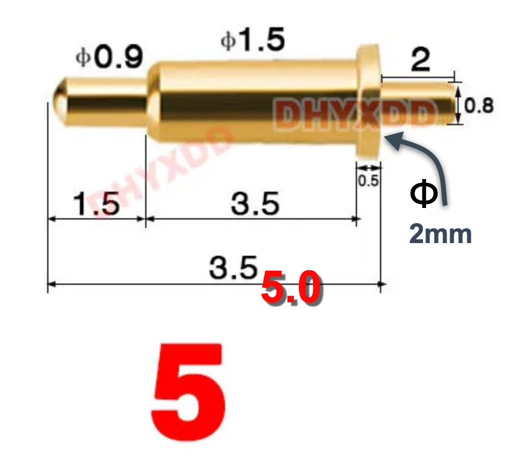

# GreenPAK Programming Pogo Probe

This project provides a standard footprint and a Pogo Probe for in-circuit programming of Renesas GreenPAK 
devices. This can be used for example in production after populating the board with factory reset GreenPAK devices.

 

Highlights:

* Small footprint.
* In expensive (e.g. compared to Tag Connect)
* Can be used with any QWIIC masters as a probrammer.
* Can provide power to the programmed device.
* A single programming socket can support multiple GreenPAK devices on the same board.

# Pogo pins

We use common pogo pins from Aliexpress, the 5mm ones from https://www.aliexpress.us/item/3256803830386881.html. The diagram belows shows the advertised dimensions on Aliexpress, note that there are two 3.5mm dimensions, the longer of the two is actually 5mm. Also, the diameter of the base is 2mm.

# Connector

The connector is JST SH 1.0mm 4pin, SMD, horizontal, and is common on Aliexpress as well as short cables with matching QWIIC connectors on both ends. This is the same connector that is used by the QWIIC and STEMMA QT eco system and follows their pinout.  

| :warning: WARNING          |
|:---------------------------|
| The connecor follows the QWIIC pinout conventions and which are different from the pinout of the Renesas programmer.  If you are using the Pogo Probe with the Renesas programmer, pay attention to the wiring.    |

# Power jumper

The solder jumper on the Pogo Probe allows to connect or disconnect the VCC power of the programmer and the programmed board. By default it's disconnected and if needed, you can connect it with a drop of solder. 

# Pullup resistors

The Pogo Probe has two footprints for pullup resistors for the SDA and SCL signals respectivly. Populating them with 5K to 10K 0402 resistors should work well in most cases. If the circuit being programmed or the I2C master used to program already contain pullup resistors (it should, since the SDA and SCL GreenPAK inputs are not pulled up internally), they can be ommited.

# Programming socket

Kicad comaptible symbol and footprint for the programming socket are available in the kicad directory of this repository.

Schematic symbol:

PCB footprint:

# Programming

We use a boards that are compatible with the Python ``i2c_adapter`` packge and the Python ``greenpak`` to program the boards. For example, if you use the SparkFun Pro Micro - RP2040 which contains a QWIIC connector, you can use a standard QWIIC cable to connect it to the Pogo Probe. Programming typically taks about 1 sec such that placing and holding the probe and hitting the program key is straight forward.

# Pin pattern

This pin patter was selected with these goals

* Small footprint.
* Non symetric, with only one right way to connect it.
* If power from the probe is not used, it can be reduced to 3 pins probe.

# PCB order

The gerber file of the Pogo Probe is available under the JLCPCB directory. Smaller boards like this typically benefit from a thinner PCB (e.g. 1mm instead of 1.6mm) but we use 1.6mm for better mechanical support and easier holding.

